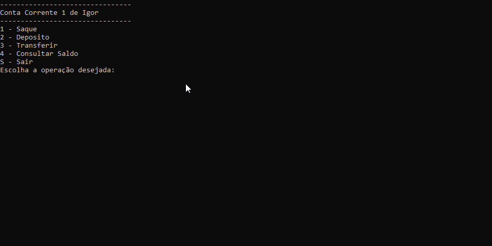

#  Conta Corrente



## Introdução

Uma simulação simplificada de uma conta corrente,onde o usuario pode escolher entre sacar,depositar ou transferir seu saldo.Alem de poder consultar o mesmo.


## Funções

**- Saque:** O usuario pode sacar o saldo de sua conta,desde que não estrapolhe - o;

**- Deposito:** O usuario pode depositar um valor na conta.

**- Tranferir:** O usuario pode tranferir um valor do seu proprio saldo para outra conta.

**- Consultar saldo:** O usuario pode visualizar seu proprio saldo.


## Como ultilizar

1. Extraia o arquivo ContaCorrente.ConsoleApp do repositório com .zip;

2. Restaure as dependecias do projeto com o ```comando```:
```
dotnet restore
```
3. Agora va até o diretório raiz e execute no terminal com o ```comando```:
```
dotnet run --project  ContaCorrente.ConsoleApp
```

## Requisitos

.NET SDK (versão 10)